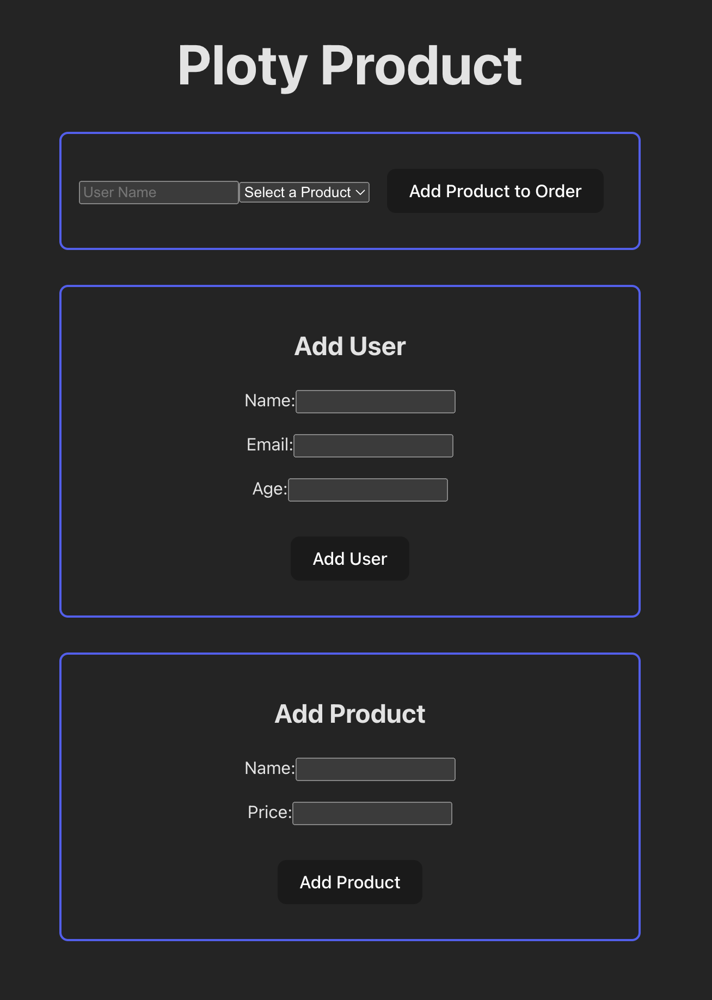

# Plotly Product Demo Application

## Getting Started

### Backend

**/backend**

```zsh
pnpm run start:dev
```
Playground http://localhost:3000/graphql

### Frontend

**/frontend**

```zsh
pnpm run dev
```
Open Application in browser http://localhost:5173/




## API DOCUMENTATION

### Mutations

#### Create User

- Operation Name: **createUser**
- Description: Creates a new user in the system.
- Input Parameters:
  - name: String (required)
  - email: String (required)
  - age: Int (required)

Example Request:

```graphql
mutation {
  createUser(name: "Bob Dobolina", email: "bob@example.com", age: 42) {
    id
    name
    email
    age
  }
}
```

Example Response:

```json
{
  "data": {
    "createUser": {
      "id": "1",
      "name": "Bob Dobolina",
      "email": "bob@example.com",
      "age": 42
    }
  }
}
```

#### Create Product

- Operation Name: **createProduct**
- Description: Adds a new product to the system.
- Input Parameters:
  - name: String (required)
  - price: Float (required)

Example Request:

```graphql
mutation {
  createProduct(name: "Laptop", price: 999.99) {
    id
    name
    price
  }
}
```

Example Response:

```json
{
  "data": {
    "createProduct": {
      "id": "1",
      "name": "Laptop",
      "price": 1399.99
    }
  }
}
```

#### Queries

#### Query Users with Orders

- Operation Name: users
- Description: Retrieves a list of users along with their associated products in the orders field.
- Parameters: None (Filters parameters could be added in the future)

Example Request:

```graphql
query {
  users {
    id
    name
    email
    age
    orders {
      id
      name
      price
    }
  }
}
```

Example Response:

```json
{
  "data": {
    "users": [
      {
        "id": "1",
        "name": "Bob Dobolina",
        "email": "Bob@example.com",
        "age": 42,
        "orders": [
          {
            "id": "1",
            "name": "Laptop",
            "price": 1399.99
          }
        ]
      }
    ]
  }
}
```
